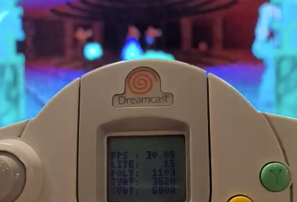

# VMU Profiler

Real-Time Visual Memory Unit Profiler for KallistiOS-Based Sega Dreamcast Applications

## Background
The VMU Profiler was created as a profiling tool for the Grand Theft Auto 3 port to the Sega Dreamcast as a way to gather real-time scene and resource statistics on actual hardware, rather than relying on emulators. Modified with extensibility for the Doom 64 port to the Sega Dreamcast.

## Statistics
    - WHATEVER YOU WANT

## Features
    - Runs in a background thread, no blocking on Maple
    - Configurable polling interval, sleeps in between updates
    - Configurable background thread priority
    - Configurable VMU port to display on
    - Configurable frames to average for smooth FPS counting
    - User-defined/configurable statistics

## Usage
	extern int xform_verts;
	void update_transformed_verts(vmu_profiler_measurement_t *m)
	{
		m->ustorage = (size_t)xform_verts;
	}

	void setup_measures(struct vmu_profiler *p) {
		vmu_profiler_measurement_t *xv_msr = init_measurement("TVRT", use_unsigned, update_transformed_verts);
		vmu_profiler_add_measure(p, xv_msr);
	}

	int main(int argc, char* argv[]) {
		// initialize video
		// initialize audio

		vmu_profiler_start(<optional configuration>, setup_measures);

		// Start the game loop
		while(!done) {
			// Update every frame
			vmu_profiler_update();
		}

		vmu_profiler_stop();

		return 0;
	}

## Building
Idk, drop them in your program source folder :-)

## Acknowledgements
100% inspired by the badass FPS monitor in [Bloom](https://github.com/pcercuei/bloom), the incredible PS1 emulator for Sega Dreamcast by [Paul Cercuei](https://github.com/pcercuei).
