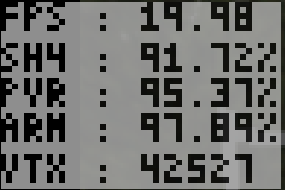
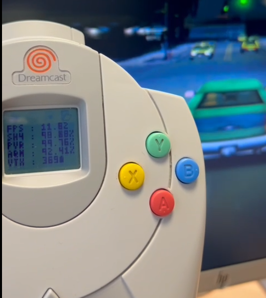

# VMU Profiler

Real-Time Visual Memory Unit Profiler for KallistiOS-Based Sega Dreamcast

## Background
The VMU Profiler was created as a profiling tool for the Grand Theft Auto 3 port to the Sega Dreamcast as a way to gather real-time scene and resource statistics on actual hardware, rather than relying on emulators.

## Statistics
    1. FPS: Frames Per Second
    2. SH4: Main System RAM Utilization
    3. PVR: Video RAM Utilization
    4. ARM: Sound RAM Utilization
    5. VTX: Number of vertices in current frame

## Features
    - Runs in a background thread, no blocking on Maple
    - Configurable polling interval, sleeps in between updates
    - Configurable background thread priority
    - Configurable VMU port to display on
    - Configurable frames to average for smooth FPS counting

## Usage
    int main(int argc, char* argv[]) {
        // initialize video
        // initialize audio

        vmu_profiler_start(<optional configuration>);

        // Start the game loop
        while(!done) {
            // Update every frame
            vmu_profiler_update(<verts in current frame>)
        }

        vmu_profiler_stop();

        return 0;
    }

## Building
Coming Soon
